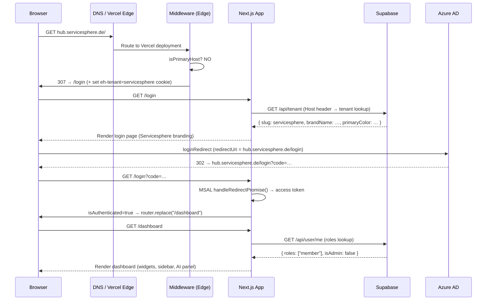
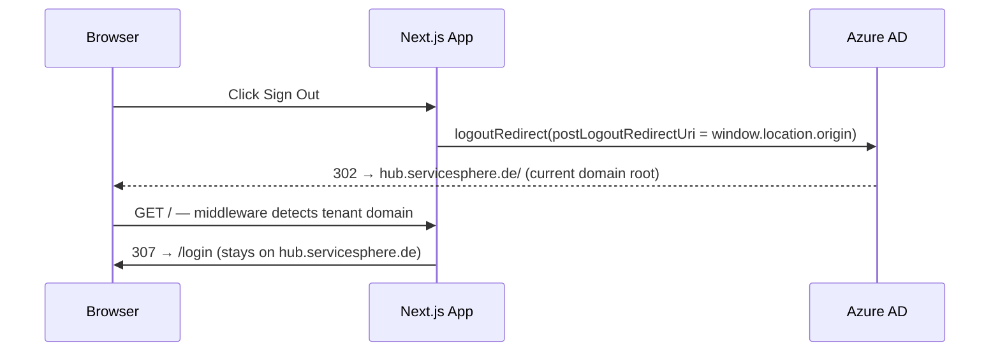
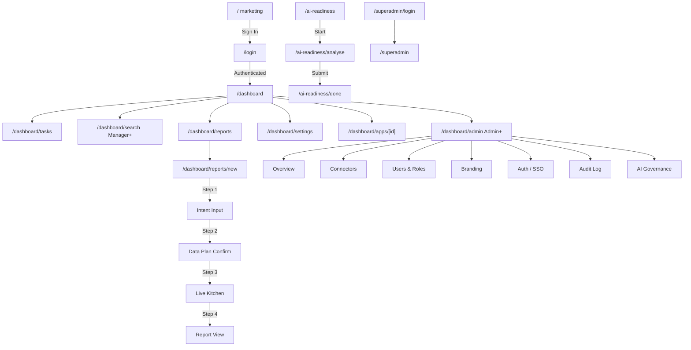
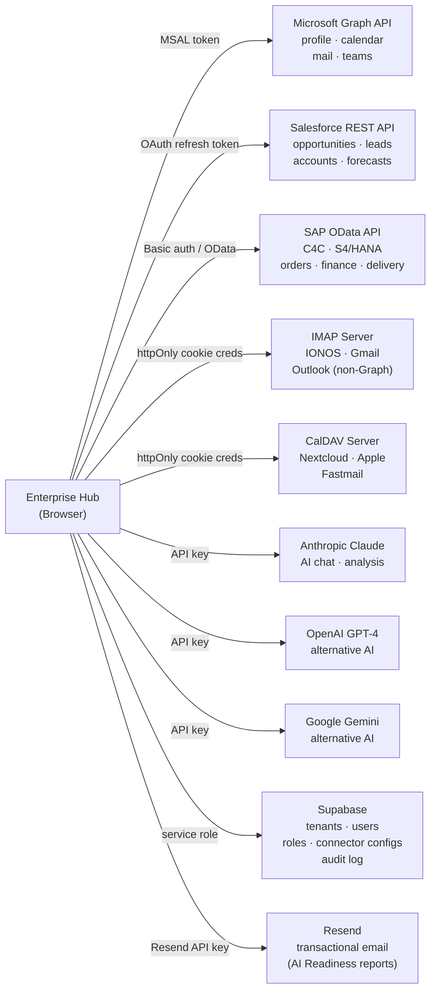

# Enterprise Hub — Architecture Reference

> Last updated: 2026-06-04  
> Stack: Next.js 16 (App Router) · TypeScript · Tailwind CSS v4 · Azure AD (MSAL) · Supabase · Vercel

---

## Table of Contents

1. [System Overview](#1-system-overview)
2. [Request Flow](#2-request-flow)
3. [Multi-Tenant Routing](#3-multi-tenant-routing)
4. [Page Map](#4-page-map)
5. [Component Tree](#5-component-tree)
6. [Context & State](#6-context--state)
7. [API Routes](#7-api-routes)
8. [Data Connectors](#8-data-connectors)
9. [External Services](#9-external-services)
10. [Security Design](#10-security-design)
11. [Tenant Onboarding Checklist](#11-tenant-onboarding-checklist)

---

## 1. System Overview

Enterprise Hub is a **multi-tenant, white-label workspace shell** that unifies enterprise apps (SAP, Salesforce, Teams, Jira, etc.) under a single Azure AD login. It is not an iframe wrapper — it is an intelligence layer that reads live data from connected systems and surfaces it through widgets, AI chat, and reports.

```
┌────────────────────────────────────────────────────────┐
│                     enterprises-hub.de                  │
│  Marketing landing page (index.html · GitHub Pages)    │
└────────────────────────────────────────────────────────┘
                            │
                  Sign In → /login
                            │
┌────────────────────────────────────────────────────────┐
│              Next.js App  (Vercel)                      │
│                                                        │
│  ┌──────────┐  ┌──────────┐  ┌──────────────────────┐ │
│  │  /login  │  │/dashboard│  │   /ai-readiness       │ │
│  │  MSAL    │  │Protected │  │   Public (no auth)    │ │
│  └──────────┘  └──────────┘  └──────────────────────┘ │
│                                                        │
│  Supabase ── Tenant config, roles, connectors, audit   │
└────────────────────────────────────────────────────────┘
                            │
           ┌────────────────┼────────────────┐
           ▼                ▼                ▼
     Microsoft          Salesforce         SAP
      Graph API          REST API       OData API
   (profile, mail,    (opps, leads,   (orders, finance,
    calendar, teams)   accounts)       delivery)
```

---

## 2. Request Flow

### Standard authenticated request



### Logout flow



---

## 3. Multi-Tenant Routing

### Domain topology

```
enterprises-hub.de          → GitHub Pages  (marketing landing page)
www.enterprises-hub.de      → Vercel        (307 from apex, primary app)
ai-readiness.enterprises-hub.de → Vercel   (rewritten to /ai-readiness/*)
hub.servicesphere.de        → Vercel        (tenant white-label domain)
hub.<customer>.com          → Vercel        (future tenant custom domain)
enterprises-hub-omega.vercel.app → Vercel  (preview fallback)
```

### Middleware decision tree (`src/middleware.ts`)

```
Request arrives at Vercel edge
        │
        ▼
Is hostname ai-readiness.*?
    YES ──► Is path /_next/* or /favicon.ico? → pass through
           Is path /ai-readiness/*?            → pass through + x-is-public: 1
           Otherwise                           → redirect /ai-readiness[path]
        │
        NO
        ▼
Is hostname a PRIMARY host?  (enterprises-hub.de, www.enterprises-hub.de,
                               localhost, *.vercel.app, *.local)
    YES ──► Is path /ai-readiness/* or /api/ai-readiness/*?
               YES → pass through + x-is-public: 1
               NO  → pass through (serves index.html at /)
        │
        NO  ← TENANT DOMAIN (e.g. hub.servicesphere.de)
        ▼
Is path = "/"?
    YES ──► 307 redirect to /login   (avoids serving EH marketing page)
        │
        NO
        ▼
Stamp eh-tenant cookie (slug from static registry)
Pass through
```

### Tenant resolution priority (server-side)

```
1. Host header   → Supabase domain lookup           (authoritative)
2. Host header   → Static registry fallback          (edge-safe, no DB)
3. eh-tenant cookie → slug lookup                   (dev / proxy only)
4. Hard default  → "default" (enterprises-hub.de)   (last resort)
```

---

## 4. Page Map

```
/                         route.ts        → serves index.html (marketing)
/login                    page.tsx        → Azure AD login (MSAL, tenant-branded)
/auth/redirect            page.tsx        → MSAL popup redirect handler

/dashboard                layout.tsx      → AuthGuard + Shell (Topbar + Sidebar)
  /dashboard              page.tsx        → Widget canvas (DashboardGrid)
  /dashboard/settings     page.tsx        → Personal & Admin settings
  /dashboard/tasks        page.tsx        → Task list
  /dashboard/search       page.tsx        → Cross-system search (Manager+ only)
  /dashboard/reports      page.tsx        → Saved reports gallery
  /dashboard/reports/new  page.tsx        → 4-step report builder
  /dashboard/apps/[appId] page.tsx        → Individual app view / deep-link
  /dashboard/admin        page.tsx        → Redirect to /admin/overview
  /dashboard/admin/[section] page.tsx     → Dynamic admin sections (RBAC-gated)

/ai-readiness             layout.tsx      → Public layout (no MSAL)
  /ai-readiness           page.tsx        → Landing / promo page
  /ai-readiness/analyse   page.tsx        → Upload form (name, email, document)
  /ai-readiness/done      page.tsx        → Confirmation / email sent

/superadmin               layout.tsx      → Superadmin shell
  /superadmin/login       page.tsx        → Internal admin login (Supabase Auth)
  /superadmin             page.tsx        → Tenant management panel
```

### Page connections (navigation graph)



---

## 5. Component Tree

### Shell (every authenticated page)

```
RootLayout  (src/app/layout.tsx)
└── TenantProvider
    └── ThemeProvider
        └── UIPrefsProvider
            └── AppsProvider
                └── AIProvider
                    └── AuthProvider  (Server Component — reads x-is-public header)
                        └── AuthProviderClient  (Client — initialises MSAL if not public)
                            └── MsalProvider
                                └── RolesProvider
                                    └── {page content}

Dashboard Layout  (src/app/dashboard/layout.tsx)
└── AuthGuard  (redirects to /login if not authenticated)
    └── DashboardProvider
        └── DashboardShell
            ├── Topbar          (user menu, theme toggle, mobile hamburger)
            ├── Sidebar         (nav items, enabled app shortcuts, connector entries)
            ├── {page content}
            └── RightPanel      (docked AI chat panel)
```

### Dashboard page widgets

```
DashboardGrid
├── WidgetShell  [ProfileWidget]     — user name, email, avatar (Graph)
├── WidgetShell  [CalendarWidget]    — today's events (Graph or CalDAV)
├── WidgetShell  [BriefingWidget]    — AI morning briefing
├── WidgetShell  [MailWidget]        — recent emails (Graph or IMAP)
├── WidgetShell  [TeamsWidget]       — Teams chats / channels
├── WidgetShell  [AppsWidget]        — enabled app shortcuts
├── WidgetShell  [SalesforceWidget]  — open opportunities
├── WidgetShell  [SAPWidget]         — SAP pipeline / orders
└── WidgetShell  [NoteWidget]        — user sticky note (local)
```

### Report Builder (4-step wizard)

```
NewReportPage  (/dashboard/reports/new/page.tsx)
├── StepBar  (Define · Confirm · Build · Report)
├── Step 1: IntentInput
│   └── SystemSelector  (SAP / Salesforce / Hub — toggle & reorder)
├── Step 2: DataPlanConfirm
│   └── buildPlanFromIntent()  (filters sources + charts by selected systems)
├── Step 3: LiveKitchen
│   └── SVG extraction animation + NarrationBar
└── Step 4: ReportView
    ├── FilterBar  (theme toggle, date range, BrandColors editor)
    ├── KPI tiles  (sparkline per tile)
    ├── ComposedChart  (bars + ghost target + delta line)
    ├── AreaChart  (trend vs prior year)
    ├── ScatterChart  (deal size vs win probability)
    ├── PieChart / Donut  (win rate)
    ├── FunnelChart  (pipeline stages)
    ├── Salesforce opportunity table  (deep links to SF records)
    └── SAP orders table  (deep links to VA03 transactions)
```

### AI Panel

```
RightPanel
└── AIPanel
    ├── FunctionChips  (Morning Briefing, Email Summary, Meeting Prep, …)
    ├── Message history
    └── Input → POST /api/ai/chat
                  ├── useAllContexts()  (aggregates all active connectors)
                  │   ├── useGraphContext()   → Graph API data
                  │   ├── useTeamsContext()   → Teams data
                  │   ├── useImapContext()    → IMAP emails
                  │   ├── useSalesforceContext() → CRM data
                  │   └── useSAPContext()     → SAP data
                  └── Provider: Anthropic / OpenAI / Gemini / Azure OpenAI / Custom
```

---

## 6. Context & State

| Context | File | Persistence | What it stores |
|---------|------|-------------|----------------|
| **TenantContext** | `contexts/TenantContext.tsx` | None (fetched on mount from `/api/tenant`) | slug, name, brandName, primaryColor, logoUrl, domain, plan |
| **ThemeContext** | `contexts/ThemeContext.tsx` | `localStorage: eh-theme` | light / dark / system |
| **UIPrefsContext** | `contexts/UIPrefsContext.tsx` | `localStorage: eh-ui-prefs` | sidebar mode, density, right panel width, nav label overrides, pinned apps |
| **AppsContext** | `contexts/AppsContext.tsx` | `localStorage: eh-enabled-apps` | set of enabled app slugs |
| **AIContext** | `contexts/AIContext.tsx` | `localStorage: eh-ai-config` + httpOnly cookie for keys | provider, model, panel position, system prompt, key status |
| **RolesContext** | `contexts/RolesContext.tsx` | None (fetched from `/api/user/me`) | roles[], isAdmin, isManager, allowedAdminSections[] |
| **DashboardContext** | `contexts/DashboardContext.tsx` | `localStorage: eh-dashboard` | widget layout (type, order, span, titles, note content) |

---

## 7. API Routes

### Auth & User

| Method | Path | Auth | Description |
|--------|------|------|-------------|
| `GET` | `/api/tenant` | None | Resolve tenant from Host header. Returns TenantConfig (no notes). |
| `GET` | `/api/user/me` | MSAL token | User profile + roles from Supabase. |
| `GET` | `/api/user/keys` | MSAL | Is personal AI key configured? (boolean only) |
| `POST` | `/api/user/keys` | MSAL | Save AI provider key to httpOnly cookie. |
| `DELETE` | `/api/user/keys` | MSAL | Clear AI provider key. |

### AI

| Method | Path | Auth | Description |
|--------|------|------|-------------|
| `POST` | `/api/ai/chat` | MSAL | Send message to AI provider. Key resolution: personal cookie → workspace Supabase → tenant env var. |
| `POST` | `/api/ai/function` | MSAL | Execute a pre-built AI function (injects connector contexts automatically). |

### Admin (Admin role required)

| Method | Path | Description |
|--------|------|-------------|
| `GET/POST` | `/api/admin/connectors` | List / create connector configs (SAP, Salesforce orgs). |
| `GET/PATCH/DELETE` | `/api/admin/connectors/[id]` | Manage individual connector. |
| `GET/POST` | `/api/admin/users` | List users / bulk import (CSV). |
| `PATCH` | `/api/admin/branding` | Update logo, color, domain, default apps. |
| `GET/POST` | `/api/admin/access-rules` | IP allowlist / 2FA rules. |
| `GET/POST` | `/api/admin/ai-config` | Shared AI API keys, model restrictions. |
| `GET/POST` | `/api/audit` | Log and retrieve audit events. |

### Connectors — Salesforce

| Method | Path | Description |
|--------|------|-------------|
| `GET` | `/api/connectors/salesforce/auth` | Start OAuth flow (redirect to Salesforce). |
| `GET` | `/api/connectors/salesforce/callback` | OAuth callback — saves refresh token. |
| `GET` | `/api/connectors/salesforce/status` | Is the user connected? |
| `GET` | `/api/connectors/salesforce/data` | Fetch opportunities / leads / contacts. |
| `DELETE` | `/api/connectors/salesforce/disconnect` | Revoke and delete token. |

### Connectors — Other

| Method | Path | Description |
|--------|------|-------------|
| `GET` | `/api/connectors/sap/data` | SAP OData — accounts, opportunities, pipeline. |
| `POST` | `/api/connectors/imap/config` | Save IMAP credentials. |
| `GET` | `/api/connectors/imap/fetch` | Fetch recent emails. |
| `DELETE` | `/api/connectors/imap/config` | Clear IMAP credentials. |
| `POST` | `/api/connectors/caldav/config` | Save CalDAV credentials. |
| `POST` | `/api/connectors/caldav/test` | Test CalDAV connection. |
| `GET` | `/api/connectors/caldav/fetch` | Fetch calendar events. |

### Public (AI Readiness)

| Method | Path | Auth | Description |
|--------|------|------|-------------|
| `POST` | `/api/ai-readiness/submit` | None | Upload document → Claude analysis → Resend email. |

### Superadmin (internal only)

| Method | Path | Description |
|--------|------|-------------|
| `GET/POST` | `/api/superadmin/tenants` | List / create tenants. |
| `GET` | `/api/superadmin/auth` | Token validation. |
| `POST` | `/api/superadmin/upload-logo` | Upload tenant logo to Vercel Blob / S3. |
| `GET` | `/api/superadmin/image-proxy` | SSRF-safe image proxy. |

---

## 8. Data Connectors



### AI context aggregation

When a user sends a message to the AI, `useAllContexts()` gathers live data from all active connectors and injects it as a system prompt addition:

```
useAllContexts()
├── useGraphContext()      → "Today you have 3 meetings: 09:00 Standup, …"
├── useTeamsContext()      → "Recent Teams activity: …"
├── useImapContext()       → "3 unread emails. From: CEO …"
├── useSalesforceContext() → "Open opportunities: €2.4M pipeline …"
└── useSAPContext()        → "SAP: 12 orders pending, top account: …"
```

---

## 9. External Services

| Service | Purpose | Credentials | Notes |
|---------|---------|-------------|-------|
| **Azure AD** | User authentication (SSO), OAuth tokens for Graph/Teams | `NEXT_PUBLIC_AZURE_CLIENT_ID`, `NEXT_PUBLIC_AZURE_TENANT_ID` | Multi-tenant (`organizations`). Every tenant domain's `/login` must be a registered Redirect URI in Azure AD. |
| **Microsoft Graph** | Profile, calendar, email, Teams | MSAL access token (per user) | Scopes: User.Read, Calendars.Read, Mail.ReadBasic, Team.ReadBasic.All, Chat.ReadBasic |
| **Supabase** | Tenant configs, users, roles, connector registry, audit logs, shared AI keys | `NEXT_PUBLIC_SUPABASE_URL`, `SUPABASE_SERVICE_ROLE_KEY` | Service role used server-side only. Supabase Auth used for superadmin login only. |
| **Anthropic Claude** | AI chat, document analysis (AI Readiness) | `ANTHROPIC_API_KEY` (env or per-tenant Supabase) | Default provider. Model: claude-sonnet-4-5. |
| **OpenAI** | Alternative AI provider | `OPENAI_API_KEY` or user personal key | |
| **Google Gemini** | Alternative AI provider | `GEMINI_API_KEY` or user personal key | |
| **Azure OpenAI** | Customer-hosted GPT-4 | `AZURE_OPENAI_API_KEY` + endpoint + deployment | For tenants requiring data residency. |
| **Salesforce** | CRM data (opportunities, leads, accounts) | OAuth 2.0 refresh token per user, stored in Supabase | Admin sets up connected app (client ID/secret). |
| **SAP** | ERP data (orders, finance, delivery) | Basic auth stored per connector config in Supabase | OData API (C4C or S4/HANA). |
| **IMAP** | Non-Graph email access | User credentials in httpOnly cookie (`eh-imap`) | Encrypted at rest. |
| **CalDAV** | Non-Graph calendar access | User credentials in httpOnly cookie (`eh-caldav`) | |
| **Resend** | Transactional email (AI Readiness reports) | `RESEND_API_KEY`, `RESEND_FROM_EMAIL` | DNS: MX + SPF + DKIM configured in IONOS. |
| **Vercel** | Hosting + Edge Middleware + Blob storage | Vercel project config | Custom domains added per tenant. |
| **GitHub Pages** | Marketing landing page (index.html) | Git push to main | `CNAME` file: enterprises-hub.de |

---

## 10. Security Design

### API key management (three-tier resolution)

```
User sends AI message
        │
        ▼
1. Personal key in httpOnly cookie?  ────YES──► Use it
        │ NO
        ▼
2. Workspace key in Supabase?        ────YES──► Verify origin, use it
        │ NO
        ▼
3. Tenant env var (ANTHROPIC_API_KEY)?────YES──► Use it
        │ NO
        ▼
   Return 402 / prompt user to add key
```

### Key storage rules

- **Personal keys**: httpOnly cookie, Path=/api, SameSite=Strict, Secure — never readable by JS, never stored in Supabase
- **Workspace keys**: Supabase, only readable server-side, origin-checked before use (prevents cross-tenant access)
- **Tenant env vars**: Vercel env — for pre-configured tenants (Servicesphere, etc.)

### SSRF protection

All URL inputs (custom AI endpoint, logo URL, CalDAV server, SAP OData URL) go through `blockSsrfTarget()`:

```
Blocked ranges:
  127.0.0.0/8      (loopback)
  10.0.0.0/8       (RFC 1918)
  172.16.0.0/12    (RFC 1918)
  192.168.0.0/16   (RFC 1918)
  169.254.0.0/16   (link-local / AWS metadata)
  ::1              (IPv6 loopback)
  fc00::/7         (IPv6 private)
```

### Authentication guards

| Layer | Mechanism |
|-------|-----------|
| Page-level | `AuthGuard` component — redirects to `/login` if `!isAuthenticated` |
| API-level | MSAL Bearer token validation on every protected route |
| Admin-level | `RolesContext` checks `isAdmin` / `isManager` before rendering admin UI |
| API admin-level | `/api/admin/*` routes check user roles via Supabase before processing |
| CSRF | `assertSameOrigin()` on all state-changing API routes |
| Tenant isolation | Host header is canonical — cookie is convenience only |

---

## 11. Tenant Onboarding Checklist

Run these steps for every new customer domain. The order matters.

```
STEP 1 — Supabase  (5 minutes)
─────────────────────────────
[ ] Open Supabase → SQL editor
[ ] Run:
    INSERT INTO tenants (slug, name, brand_name, primary_color, domain, plan, active, created_at)
    VALUES ('acme', 'Acme Corp', 'Acme Hub', '#0052CC', 'hub.acme.com', 'pro', true, now());
[ ] Optionally set azure_tenant_id if locking to one Azure directory

STEP 2 — DNS  (5 minutes + propagation)
────────────────────────────────────────
[ ] Go to DNS provider for acme.com (IONOS, Cloudflare, Route53, etc.)
[ ] Add record:
      Type:  CNAME
      Host:  hub
      Value: cname.vercel-dns.com        ← must be CNAME, NOT a URL forward/redirect
      TTL:   3600
[ ] Remove any existing A record or URL forward for 'hub'

STEP 3 — Vercel  (2 minutes)
─────────────────────────────
[ ] Vercel → enterprises-hub project → Settings → Domains → Add Existing
[ ] Enter: hub.acme.com
[ ] Wait for blue ✓ "Valid Configuration" (auto-detects CNAME, issues SSL cert)

STEP 4 — Azure AD  (5 minutes)
────────────────────────────────
[ ] Azure Portal → App registrations → enterprises-hub → Authentication
[ ] Under "Redirect URIs" → Add:
      https://hub.acme.com/login
[ ] Save

STEP 5 — Verify  (2 minutes — must pass all three)
───────────────────────────────────────────────────
[ ] Open hub.acme.com in a FRESH INCOGNITO window
[ ] ✓ URL stays on hub.acme.com (does not redirect to www.enterprises-hub.de)
[ ] ✓ Login page shows Acme Corp branding (logo, primary colour, "Acme Hub")
[ ] ✓ Sign in → lands on hub.acme.com/dashboard
[ ] ✓ Sign out → returns to hub.acme.com/login  (not enterprises-hub.de)
```

### Common mistakes

| Symptom | Root cause | Fix |
|---------|-----------|-----|
| Redirects to `www.enterprises-hub.de` | DNS set as **URL forward** instead of CNAME | Delete the URL forward, add a proper CNAME record |
| Redirects to `www.enterprises-hub.de` | Domain not added in Vercel (Vercel redirects unknown domains to primary) | Add the domain in Vercel → Domains |
| Azure AD error `AADSTS50011 redirect_uri mismatch` | `/login` not registered in Azure AD | Add `https://hub.acme.com/login` to Redirect URIs |
| Login page shows "EnterpriseHub" branding instead of tenant | Tenant not in Supabase or domain doesn't match | Check Supabase `tenants` table — `domain` must match exactly |
| After logout, user lands on wrong domain | Old code bug (now fixed): logout was hardcoded to `www.enterprises-hub.de` | Deploy latest code (fixed in `f6010eb`) |

---

## File Structure Reference

```
src/
├── app/
│   ├── route.ts                    ← Serves index.html at /
│   ├── layout.tsx                  ← Root layout + all context providers
│   ├── globals.css                 ← Design tokens (--paper, --ink, --shell-*)
│   ├── login/page.tsx              ← Azure AD login (tenant-branded)
│   ├── auth/redirect/page.tsx      ← MSAL popup redirect handler
│   ├── dashboard/
│   │   ├── layout.tsx              ← AuthGuard + DashboardShell
│   │   ├── page.tsx                ← Widget canvas
│   │   ├── settings/page.tsx       ← Personal + admin settings
│   │   ├── tasks/page.tsx
│   │   ├── search/page.tsx
│   │   ├── reports/
│   │   │   ├── page.tsx            ← Reports gallery
│   │   │   └── new/page.tsx        ← 4-step report builder
│   │   ├── apps/[appId]/page.tsx
│   │   └── admin/[section]/page.tsx
│   ├── ai-readiness/               ← Public feature (no Azure AD)
│   │   ├── layout.tsx
│   │   ├── page.tsx
│   │   ├── analyse/page.tsx
│   │   └── done/page.tsx
│   ├── superadmin/                 ← Internal admin panel
│   │   ├── layout.tsx
│   │   ├── page.tsx
│   │   └── login/page.tsx
│   └── api/
│       ├── tenant/route.ts         ← Tenant resolution
│       ├── user/                   ← Profile, roles, AI keys
│       ├── ai/                     ← Chat + AI functions
│       ├── admin/                  ← Workspace admin
│       ├── connectors/             ← Salesforce, SAP, IMAP, CalDAV
│       ├── ai-readiness/           ← Public document analysis
│       ├── audit/
│       └── superadmin/
├── components/
│   ├── AuthProvider.tsx            ← Server: reads x-is-public header
│   ├── AuthProviderClient.tsx      ← Client: initialises MSAL conditionally
│   ├── Topbar.tsx                  ← Top navigation bar
│   ├── Sidebar.tsx                 ← Left navigation + app shortcuts
│   ├── DashboardShell.tsx
│   ├── RightPanel.tsx              ← Docked AI panel
│   ├── ai/                         ← AI chat components
│   ├── dashboard/                  ← Grid, widgets, widget shell
│   ├── reports/                    ← Report builder components
│   ├── settings/                   ← Settings panel components
│   ├── admin/                      ← Admin panel components
│   └── icons/index.tsx             ← SVG icon library
├── contexts/
│   ├── TenantContext.tsx
│   ├── ThemeContext.tsx
│   ├── UIPrefsContext.tsx
│   ├── AppsContext.tsx
│   ├── AIContext.tsx
│   ├── RolesContext.tsx
│   └── DashboardContext.tsx
├── lib/
│   ├── msal.ts                     ← MSAL config (lazy, browser-only)
│   ├── tenant/                     ← types, registry, db
│   ├── supabase/server.ts          ← Supabase admin client
│   ├── api-security.ts             ← CSRF, SSRF, key helpers
│   ├── apps.ts                     ← App catalog
│   ├── ai-providers.ts             ← Provider + model definitions
│   ├── connectors/                 ← Graph, Teams, Salesforce, SAP, IMAP, CalDAV
│   ├── ai-functions/               ← Pre-built AI function registry
│   ├── ai-readiness/               ← Document analysis + email
│   └── superadmin-auth.ts
├── middleware.ts                   ← Edge: tenant routing, cookie, public header
└── hooks/
    └── useBrandColors.ts           ← Report colour palette (localStorage)
```
